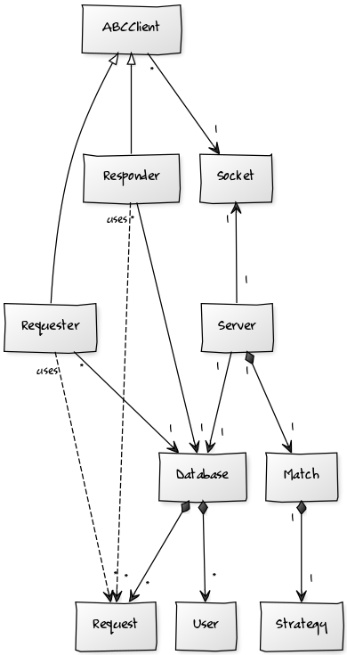

# Match application

Match application for the course Advanced Software Design.
This has been implemented using Stream Sockets on top of TCP.

To start the Match server type:

    python server.py

To start the requester client type:

    python requester.py

To start the responder client type:

    python responder.py

## Class diagram

The diagram has been generated using yUML (in file `diagram.yUML`). To generate the
diagram, visit [yuml.me](http://yuml.me/diagram/scruffy/class/draw) and
paste the content of the `diagram.yUML` file.

## How does it work?

There is a centralized server, **Match Server**, to which requesters and responders
connect to. The **requesters** are clients in need of a service, who are willing
to pay an amount of money in order to get help to carry the advertised task.
**Responders** are customers who signed up in the **Match server** and are
waiting to receive an offer where they might be able to help. **Responders**
do not choose the offer they think they fit best, the **Match server** AI
algorithm determines who is the best candidate and passes the offer on.

## Use cases

Read description of the assignments

## TODO

- ~~the client should be able to post new services~~

- ~~the client should be able to check if he has a request~~

- ~~the client should be able to confirm requests~~

- ~~the server sends requests to the clients based on affinity~~
